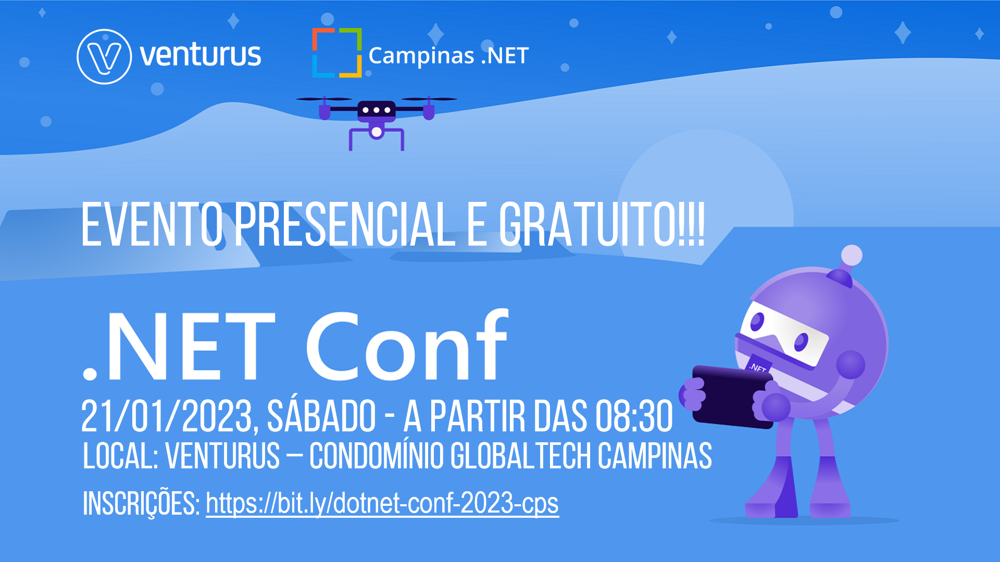

# .NET Conf 2023 - Campinas-SP | Presencial e Gratuito
Fotos e informações gerais sobre a **edição local do .NET Conf** realizado em **21/01/2023** na cidade de **Campinas-SP**.

Organizadores:
- **Renato Groffe (Microsoft MVP, MTAC)**
- **Ericson da Fonseca (Microsoft MVP)**

Número de participantes: **85 pessoas**

Apresentações que aconteceram durante o evento:
* Keynote - .NET Conf novamente em Campinas-SP - Ericson da Fonseca (Microsoft MVP)

* .NET 7, Azure e o Meio Ambiente - Murilo Beltrame (DevPira)

* Observabilidade em .NET - Se sua aplicação cair, quem descobre primeiro? Você ou seus clientes? - Matheus Barros (DevPira)

* SQL Server High Availability and Disaster Recovery - Roberto Fonseca (Microsoft MVP, MTAC)

* .NET 7 + ASP.NET Core: principais novidades no desenvolvimento Back-End - Renato Groffe (Microsoft MVP, MTAC)

* Desenvolvendo o site do .NET com .NET!!! - Maíra Wenzel (Principal Program Manager - Microsoft)

Este evento foi uma parceria entre as comunidades [**Campinas .NET**](https://www.meetup.com/campinasdotnet/), [**.NET SP**](https://www.meetup.com/dotnet-Sao-Paulo/) e [**Azure Talks**](https://www.meetup.com/azure-talks/).

Formulário utilizado para inscrições: [**Sympla**](https://www.sympla.com.br/evento/net-conf-2023-campinas-sp-presencial-e-gratuito/1780810)

Local: Auditório da Venturus - Estrada Giuseppina Vianelli di Napolli, 1185 - Polo II de Alta Tecnologia - Campinas - SP - CEP: 13086-530

